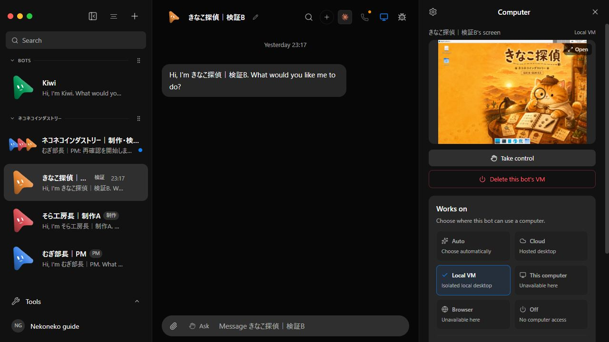

# GUI付きBotの制作・別GUI検証を再現する

Grok BotのOSS版「OpenMausBot」に、むぎPM・そら制作・きなこ検証の3体を用意するセットです。そらときなこは別々のGUIでFirefoxを操作し、単一HTMLの制作と検証を分担します。公式v0.1.61のコードをそのまま使い、この記事用フォルダだけを追加します。このREADMEで取得・設定・起動・承認・成果物の取り出しまで進められます。

## 1. 必要なものとコードの取得

- Windows x64、WSL2、Git、Podman。
- Z.ai Coding Planと利用可能なAPIキー。既定モデルはGLM-5.3です。契約の対象モデル・利用枠を確認してください。
- イメージのダウンロード、ビルド、本体とGUI2台を動かすメモリ・空きディスク。

未導入のものだけPowerShellでインストールします。WSL2未設定なら先に `wsl --install` を実行し、必要に応じ再起動してください。

```powershell
winget install --exact --id Git.Git
winget install --exact --id RedHat.Podman
```

Podman公式インストール案内：

https://podman.io/docs/installation

Z.aiのプラン・料金と、APIキー取得を含むClaude Code接続案内：

https://z.ai/subscribe

https://docs.z.ai/devpack/tool/claude

PowerShellを開き直し、WSLからアクセスできるCドライブなどで実行します。

```powershell
git clone https://github.com/milind-soni/OpenMausBot.git OpenMausBot-nekoneko
git -C OpenMausBot-nekoneko checkout 9c681f44a02385ea21d5a3610a658e8eabbf2bfa
git clone --filter=blob:none --sparse --branch nekoneko-official-kit-2026-09-07 https://github.com/Sunwood-ai-labs/OpenMausBot.git OpenMausBot-article-kit
git -C OpenMausBot-article-kit sparse-checkout set deploy/nekoneko
Copy-Item .\OpenMausBot-article-kit\deploy\nekoneko .\OpenMausBot-nekoneko\deploy\nekoneko -Recurse
cd OpenMausBot-nekoneko
```

以降は、このリポジトリ直下で実行します。公式コードは `9c681f44`、追加資材は別タグで固定します。forkから使うのはdeploy/nekonekoだけです。資材の開発ブランチは `codex/nekoneko-official-kit` です。完成HTMLの例は `deploy/nekoneko/example/index.html` をブラウザで直接開けます。

## 2. 保存先・モデル・ポートを設定する

既定値のまま使う場合は、そのまま次のsetupへ進めます。変更したい場合だけ、初回setup前にテンプレートをコピーします。既存設定がある場合は上書きせず、そのファイルを編集してください。

```powershell
Copy-Item .\deploy\nekoneko\settings.env.example .\deploy\podman\.env.nekoneko
notepad .\deploy\podman\.env.nekoneko
```

この1ファイルを起動・認証・チーム作成・成果物exportで共通利用します。記入は `KEY=value` の実値です。`$HOME` や `${変数}` などの展開式は使いません。APIキーもここには記載しません。

- `OMB_PODMAN_MACHINE`：既定は `openmausbot`。既存machineを再利用し、存在しなければsetupが作成します。新規時の初期割当は4 CPU / 10 GiB / 60 GiBで、既存machineの割当は変更しません。
- `COMPOSE_PROJECT_NAME`：既定は `nekoneko-article`。既存アプリと異なる名前を使います。
- `OMB_DATA_ROOT`：空欄なら選択machineのLinuxホーム内 `nekoneko-article` をsetupが絶対パスへ解決します。指定時は新しいLinuxの絶対パスを使います。既存アプリのデータを移行する処理はありません。
- `PODMAN_SOCKET`：空欄ならmachine内ユーザーのsocketを解決します。
- `OMB_PORT` / `OMB_WEBHOOK_PORT` / `OMB_HTTP_PORT`：既定は31799 / 31800 / 31880。互いに異なる空きポートを選びます。
- `OMB_PUBLIC_URL`：空欄なら `http://localhost:<OMB_HTTP_PORT>` を生成します。HTTPポートを後から変更する際はURLも変更するか空欄に戻します。
- `OMB_GLM_MODEL` / `OMB_ANTHROPIC_BASE_URL`：既定は `glm-5.3` / `https://api.z.ai/api/anthropic`。キー確認と3体のモデル設定に共通で使います。
- `OMB_TURN_TIMEOUT_MINUTES`：1ターンの上限。既定20分、設定範囲1〜120分。
- `OMB_IMAGE_TAG`：記事用アプリのイメージタグ。既定は `nekoneko-article`。
- `ENGINES`：インストールするCLI。既定は `@anthropic-ai/claude-code@2.1.263`。

設定変更は作業終了後、**旧設定のままstopしてから編集**します。続けてsetup・upを実行し、モデルや接続先を変更した場合はconfigure・check・teamも実行してください。データ先を変えると別のチーム用保存領域になります。machineを変える場合はデータとsocketの値も新machineに合わせます。`-Machine NAME`で一時指定する場合は同じ対象を一貫して指定してください。

## 3. ビルドして起動

```powershell
.\deploy\nekoneko\nekoneko.ps1 setup
.\deploy\nekoneko\nekoneko.ps1 up
```

setup/upは公式commitと追跡ファイルの差分ゼロを確認します。追加フォルダや.envは追跡対象外です。setupがmachine側ホーム・socketを解決し、専用保存領域と識別マーカーを作ります。マーカーのない既存データへの上書きを拒否します。生成した `.env.nekoneko` はGit管理対象外です。

upはソースからビルドして起動し、アプリのhealthyを待ちます。初回はダウンロードとビルドに時間がかかります。既定の画面URLは `http://localhost:31880`。設定値と状態はdoctorで確認できます。

```powershell
.\deploy\nekoneko\nekoneko.ps1 doctor
```

## 4. GLMのキーを登録する

```powershell
.\deploy\nekoneko\nekoneko.ps1 configure
.\deploy\nekoneko\nekoneko.ps1 check
```

configureの非表示入力欄へ自分のCoding Plan APIキーを入力します。キーはstdin経由で渡し、専用Linuxデータへ保存します。アプリ再起動後のhealthyまで待ちます。Bot作業中の設定変更は拒否します。

checkは実モデルへ短いリクエストを送り、成功時に `NEKONEKO_GLM_OK` を表示します。契約の利用枠を消費します。失敗したらキー・対象モデル・ネットワークを確認して再実行してください。

## 5. チームと専用GUIを作る

```powershell
.\deploy\nekoneko\nekoneko.ps1 team
.\deploy\nekoneko\nekoneko.ps1 pair
```

teamは管理GUIイメージを準備し、次の3体とグループを作ります。

- むぎ部長：PM。Computer offで仕事の割当と報告の集約を担当。
- そら工房長：制作担当。専用GUI Aと保存先、そらの壁紙。
- きなこ探偵：検証担当。別のGUI Bと保存先、きなこの壁紙。

全員が設定ファイルのモデルを使います。壁紙内の「GLM-5.3」は静的なイラスト表記です。壁紙はteamが自動適用し、再作成時にも反映します。Bot ID・実際の保存先・GUIコンテナ名はデータ領域の `nekoneko-team.json` に保存します。

ブラウザで表示URLを開き、pairのコードを入力します。「ネコネコインダストリー｜制作・検証室」を開いてください。画面を見るときは、そら／きなこ**各BotのComputer**を開きます。プレビューで画面を確認できます。OpenやTake controlを押すと人間が操作権を取り、Botのクリックが止まります。手動確認後はHand control backでBotへ返してください。グループの共有Computerパネルとは別です。このセットで確認したのは、発言者へそのBot自身のGUI操作接続を渡す動作です。



CLI本体とコンテナ管理socketは同じアプリにあり、GUIとworkspaceがBot別です。そらのHTMLは、きなこの保存先へ明示的にコピーして渡します。

## 6. 制作から別GUI検証まで動かす

```powershell
.\deploy\nekoneko\nekoneko.ps1 start
.\deploy\nekoneko\nekoneko.ps1 status
```

startは実パスを含むGoalを送ります。単一HTMLに会社紹介、製品9点、社員猫3匹、カテゴリ切替、FAQを作り、そらの確認後にきなこが別GUIで検証する指示です。外部公開は指示しません。

**承認カードが出たら、アプリで操作内容を読んで許可してください。** `Review routine approvals`はOnです。Always allowの一括登録はしません。必要ならツール・プログラムごとに許可します。質問カードにも回答してください。

statusの `pendingCards` は直近100件のグループ履歴を調べます。Goal状態は最大100ページ遡って探し、見つからなければ `unknown`、探索を打ち切れば `goalSearchTruncated: true` を返します。空のpendingCardsだけで承認待ちなしと判断せず、アプリ側も確認します。

ページ表示・カテゴリ切替・スクロール・FAQ開閉は、それぞれの画像と報告で判定してください。Goalのcompletedと各項目の成功を分けて見ます。生成デザイン、実行時間、必要な承認は毎回変わります。

### 成果はあるがGoalがblockedになったとき

最初の実GLM検証では成果物を作成・検証できましたが、PMが最終JSONの閉じ引用符と波括弧を欠落させ、Goalはblockedになりました。指示へ完全なcompleted例を追加しています。不正JSONを自動で成功へ読み替える処理はありません。

既存のA/B双方のHTMLがある場合は、前回の作業が止まってから次を実行できます。

```powershell
.\deploy\nekoneko\nekoneko.ps1 review
.\deploy\nekoneko\nekoneko.ps1 status
```

reviewは既存HTMLを上書きせず、ハッシュ・実PNG・報告を確認する**新しいGoal**です。足りない確認は担当へ依頼します。UIの状態を強制的にcompletedにする操作ではなく、要件に応じcompleted／needs-input／blockedを判断させます。

## 7. 成果物を取り出す

Goalと各Botが停止してから実行します。

```powershell
.\deploy\nekoneko\nekoneko.ps1 export
```

`nekoneko-output/`へA/BのHTML・保存済みPNG・ハッシュ一覧をコピーします。`sora/index.html` と `kinako/index.html` を開いて比較できます。認証ファイルや会話全体はexport対象に含めません。PNGが足りなければ、担当へ追加撮影を依頼し、作業が止まってから再exportします。

## 8. 停止・再開と診断

```powershell
.\deploy\nekoneko\nekoneko.ps1 stop
```

記事用のGUIとComposeプロジェクトを停止します。選択machine全体を停止する処理はありません。再開は次の2つです。

```powershell
.\deploy\nekoneko\nekoneko.ps1 up
.\deploy\nekoneko\nekoneko.ps1 team
```

保存済みBotとグループを再利用し、停止した管理GUIをworkspaceを保持して再作成します。フォントはイメージに含まれ、壁紙も再適用します。作業中は再設定を拒否します。

```powershell
.\deploy\nekoneko\nekoneko.ps1 doctor
.\deploy\nekoneko\nekoneko.ps1 help
```

doctorはmachine・project・保存先・URL・モデルとCompose状態を表示し、healthyならチーム状態も確認します。healthy待ちが切れた場合や接続先が分からなくなった場合に使います。

### 強制終了後にDataDirLeaseErrorが出たとき

まず `stop` で専用Composeを停止し、`doctor` の保存先とプロジェクトを確認します。古い起動記録にPIDが残ると再開を拒否する場合があります。leaseファイルを機械的に消さず、そのデータを使う別プロセス・コンテナが動いていないかを確認してください。通常の終了にはmachine強制停止より、本手順の `stop` を使います。アプリがunhealthyのときはCompose停止を優先するため、GUI停止の確認も復旧後に行ってください。

## 公式コードと追加資材の範囲

公式v0.1.61（9c681f44）にはPR #849/#855/#856/#857が含まれます。server、Containerfile、公式Compose、maus.ps1は編集しません。追加するのはdeploy/nekonekoフォルダと、setupが作る未追跡のdeploy/podman/.env.nekonekoです。

- compose.override.yaml：公式ComposeへGLM設定とreadonlyのhelperマウントを追加。
- configure/team：キー登録、3Bot・2GUI、Goal指示、export、停止処理。
- wallpapers/example：既存の猫壁紙と完成HTML例。
- release.json：公式commitと資材タグの対応。

公式Containerfileがアプリをビルドし、記事helperはreadonlyマウントで使います。公式の管理GUIイメージを利用し、準備済みなら再利用します。独自のGUI image namespaceやserver差分は要求しません。データ・Compose project・ポートは記事用に分けます。

Goalの完全なJSON例は記事用の依頼文へ入れています。公式の終了判定parserも変更しません。

https://github.com/milind-soni/OpenMausBot/pull/849

https://github.com/milind-soni/OpenMausBot/pull/855

https://github.com/milind-soni/OpenMausBot/pull/856

https://github.com/milind-soni/OpenMausBot/pull/857

確認後も公式コードが変わっていないことを確認できます。成功時は差分が出ず終了コード0です。

```powershell
git diff --exit-code 9c681f44a02385ea21d5a3610a658e8eabbf2bfa --
```

新方式の結果はVALIDATION.md、旧差分移植版の実験結果はLEGACY-VALIDATION.mdへ分けています。
