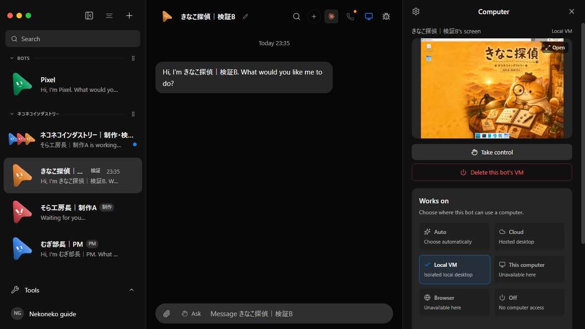
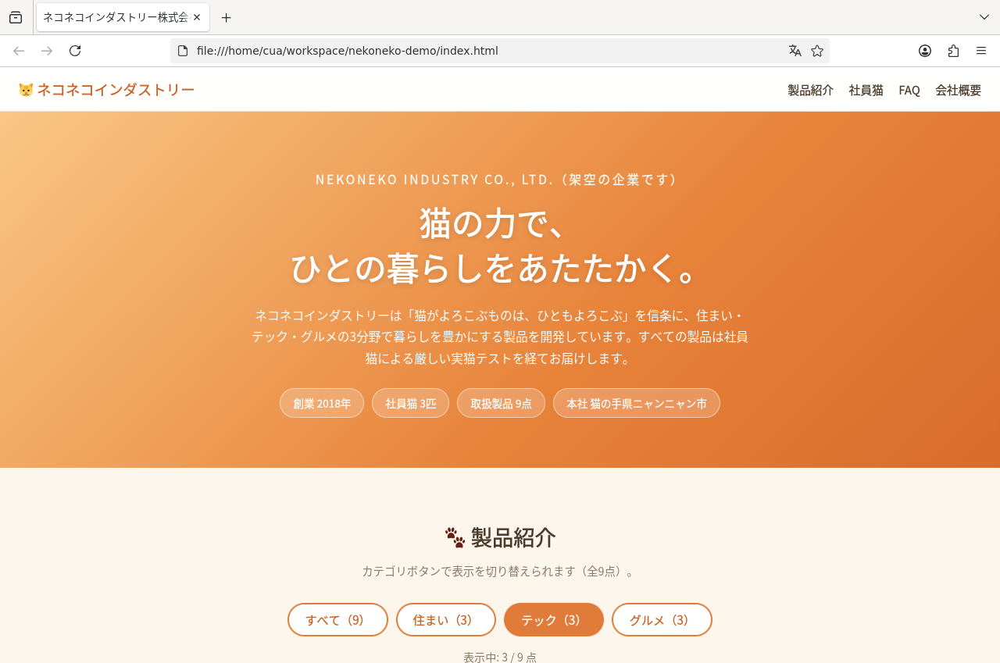
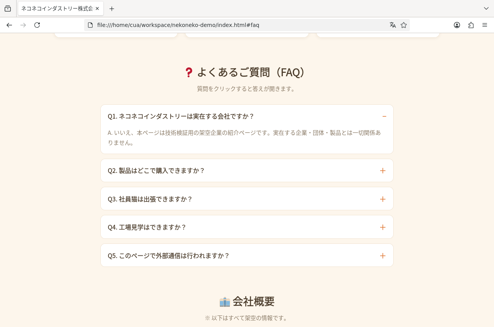
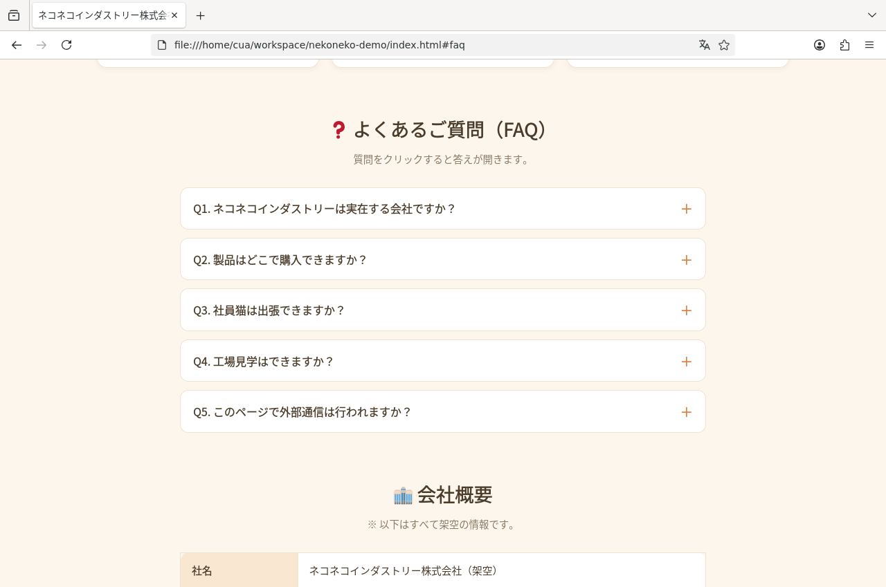

# 公式コード＋記事用資材の検証

## 対象

- 公式: https://github.com/milind-soni/OpenMausBot
- 公式commit: `9c681f44a02385ea21d5a3610a658e8eabbf2bfa`（v0.1.61）
- 記事資材: `deploy/nekoneko`。公式のserver・Containerfile・Compose・maus.ps1は変更しません。
- Windows x64、PowerShell 7.6.5、Git 2.53.0.windows.3。
- Podman Windows client 5.8.3、既存WSL2 machine内のPodman 5.8.6。
- モデル: Claude Code経由のZ.ai GLM-5.3。APIキーは認可済みの既存設定からstdin経由で登録。対話版も同じconfigure処理を使います。

## コードの取得と起動

公式リポジトリをGitHubから別フォルダへ直接cloneし、上記commitへcheckout。資材は公開forkブランチの別sparse cloneからdeploy/nekonekoだけをコピーしました。

空の専用データ領域でsetup→up（公式Containerfileによるbuild）→configure→check→teamを実行。app healthy、Caddy起動、`NEKONEKO_GLM_OK`、3 Bot、2 GUI、個別壁紙の適用を確認しました。データ・Compose project・ポートは普段使う本体から分離しています。

`git diff --exit-code 9c681f44a02385ea21d5a3610a658e8eabbf2bfa --` は終了コード0。未追跡の追加フォルダとignoredの.envだけが存在します。

記事資材のhelper11テスト成功。別model/endpoint/port/timeout、既存グループIDの更新、繰り返し停止、HTML/PNGに限定したexport、パス境界、Goal履歴の探索上限を確認しました。PowerShell/Python構文とCompose統合設定も確認しています。

## ブラウザ

pair→Connect→Maybe later→Continue→Not nowを実操作。きなこのBot’s computerでLocal VMと猫壁紙のプレビューを確認しました。Bot動作中はOpen/Take controlを押さず、操作権を取得していません。

## 制作と別GUI検証

新規Goalは正式completed。5ターン、27分54.588秒（2026-09-07T14:37:04.571Z〜15:04:59.159Z）。全Bot idle、未回答の承認カードなし。人間/検証エージェントが操作内容を確認して単発承認しています。

そらが単一HTMLを制作し、自GUIでカテゴリを変更。FAQの操作に合わせ、制作物の実装をdetailsからbutton＋aria-expandedへ調整しました。きなこは最終HTMLだけを自workspaceへコピーし、自分の別GUIで検証。両側でテック選択時の表示3/9とFAQ Q1の開閉を実PNGで確認しました。その他カテゴリや残りFAQ4問の個別操作はこの記録の検証範囲外です。

両HTMLは17,427 bytes、SHA-256 `5f7a91c07952f7c6ac2e111969cf5adbc8d24c8f2e965f1b8ddabc8b83ed18b7` で一致。各BotがPNG3枚を保存し、exportは2HTML＋6PNGの8成果物。全ファイルを再ハッシュしてmanifestと一致しました。manifest自身は成果物数に含めません。

`example/index.html`はこの実行の完成HTMLです。状態・時刻・画像hashは`evidence/official-run.json`へ記録しています。

## 停止・再開

export→stop→stop→up（公式Containerfileで再ビルド）→team→exportを実行し、終了コード0。停止前後の2HTML＋6PNG、全8ファイルの相対パス・サイズ・SHA-256が一致しました。export時刻が変わるmanifest自身は比較対象に含めません。

再開後も公式HEADは9c681f44、追跡ファイル差分ゼロ。Botとグループを再利用し、各workspaceを保持してGUI2台と壁紙を復元しました。記事専用のComposeとGUIだけを操作し、machine全体は停止していません。

## レビューと確認範囲

2名のサブエージェントが資材コードと記事手順をレビュー。保存先は新規専用ディレクトリ、設定値は展開式なしの実値と追記しました。公式追跡ファイルに変更がないことも独立して確認しています。

既存WSL2 machine上で空のアプリデータから確認しています。新規WindowsへのOS・WSL・Podmanインストール全体はこの検証に含めません。GUIは公式の管理イメージを再利用しました。異なるモデル、料金プラン、他OSの動作はこの結果から一般化しません。

会話生データ、認証ファイル、署名付き画像URL、VNC接続情報は配布しません。公開物はレビュー済みHTML/画像と検証記録です。開発途中の旧構成の実験はLEGACY-VALIDATION.mdへ分けています。
