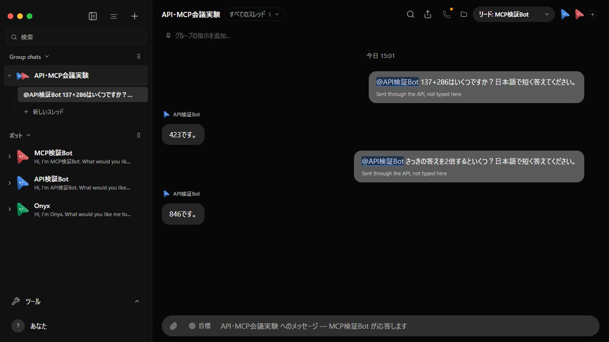

# API検証Botへの明示的なメンション検証

2026-09-13。上流最新をfetchし536b7893（0.1.76）であることを確認。統合ブランチ44ea449bのアプリを使用。

既定の応答者をMCP検証Botに設定した上で、HTTP APIと実MCP stdioからそれぞれ @API検証Bot を送った。どちらもAPI検証Botの実Claude Code / GLM-5.3が回答した。

1. HTTP API: @API検証Bot 137+286はいくつですか？ → 423です。
2. MCP stdio: @API検証Bot さっきの答えを2倍するといくつ？ → 846です。

summary.jsonで両回答のfrom.botIdがAPI検証Botであること、既定の応答者が別Botであることをassertした。provider-models.jsonに実CCセッションのglm-5.3を保存。



スクリーンショットでは上部リードがMCP検証Bot、2つの @API検証Bot が青いハイライト、その直後の発言者がAPI検証Bot、回答が423と846であることを目視確認。DOM記録はui-snapshot.txt。要求と応答はtransport.json。

```powershell
$env:OMB_EVIDENCE_DIR='docs/verification/evidence/api-mention-20260913/glm'
node scripts/launch-api-mcp-glm.mjs C:/Users/makim/.local/bin/claude.exe
node scripts/verify-api-mention.mjs http://127.0.0.1:20019 --glm
```

使用ポートは起動ごとに異なる。資格情報は保存しない。一時環境のみを操作し、終了後はランチャーのstopで削除した（cleanup.json）。以前の証拠は上書きしていない。
