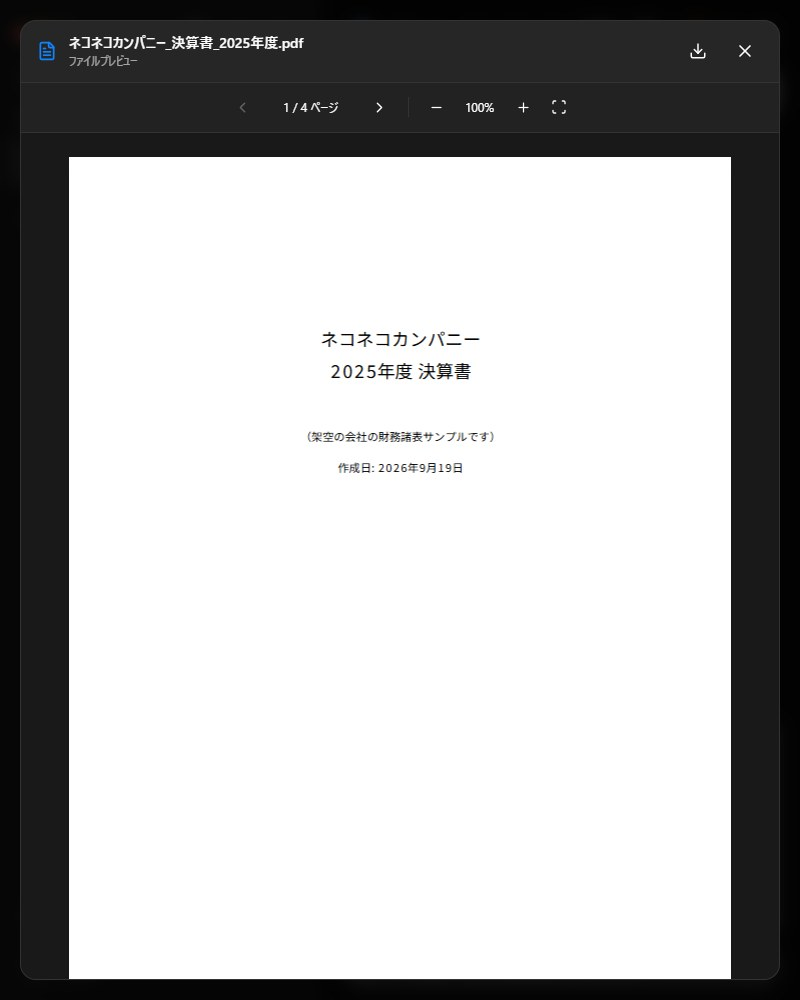
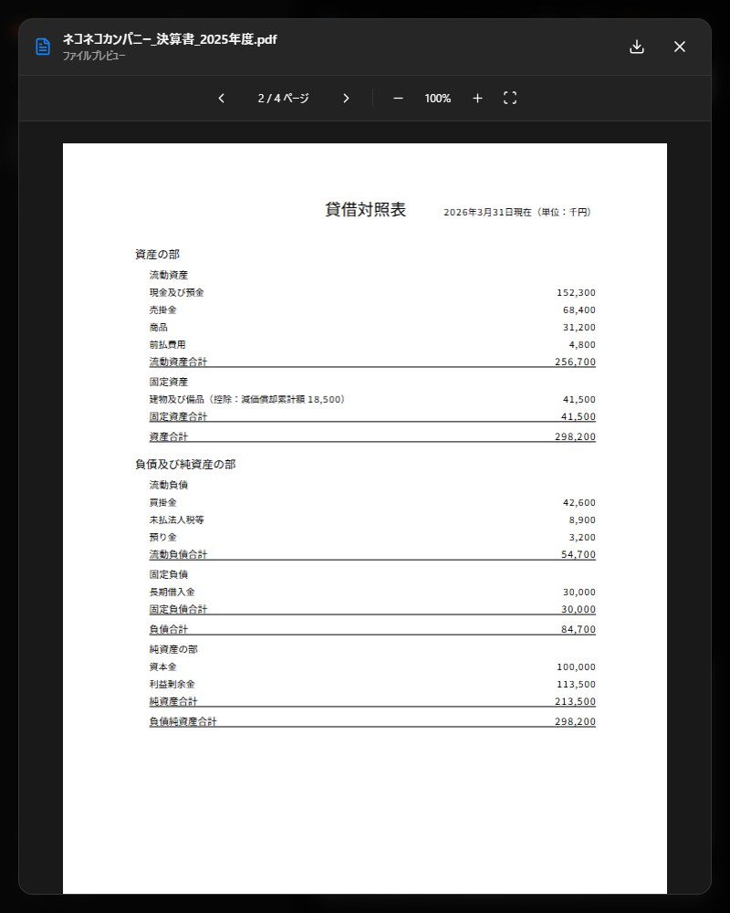
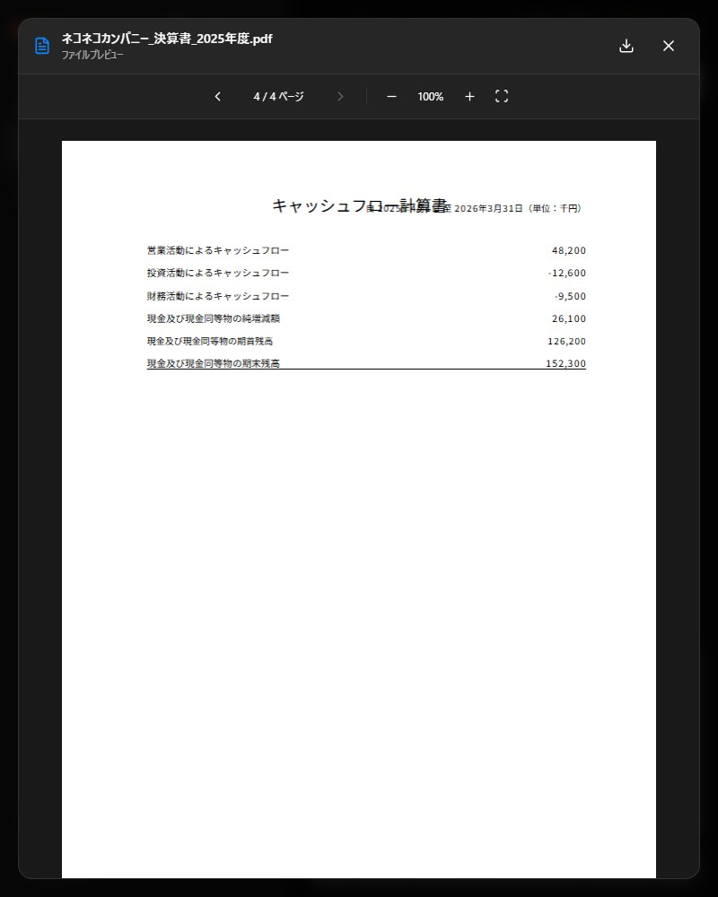
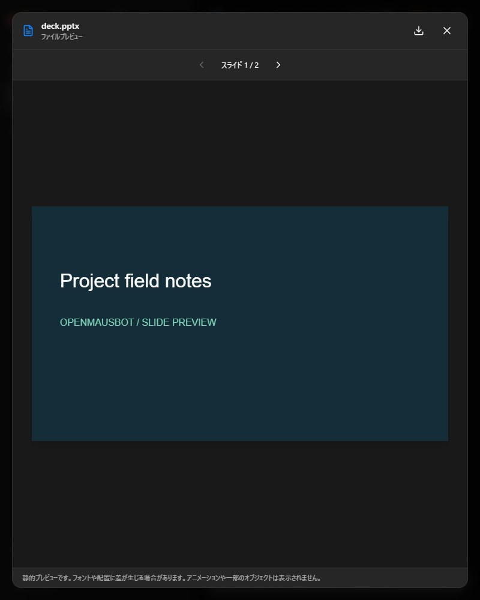
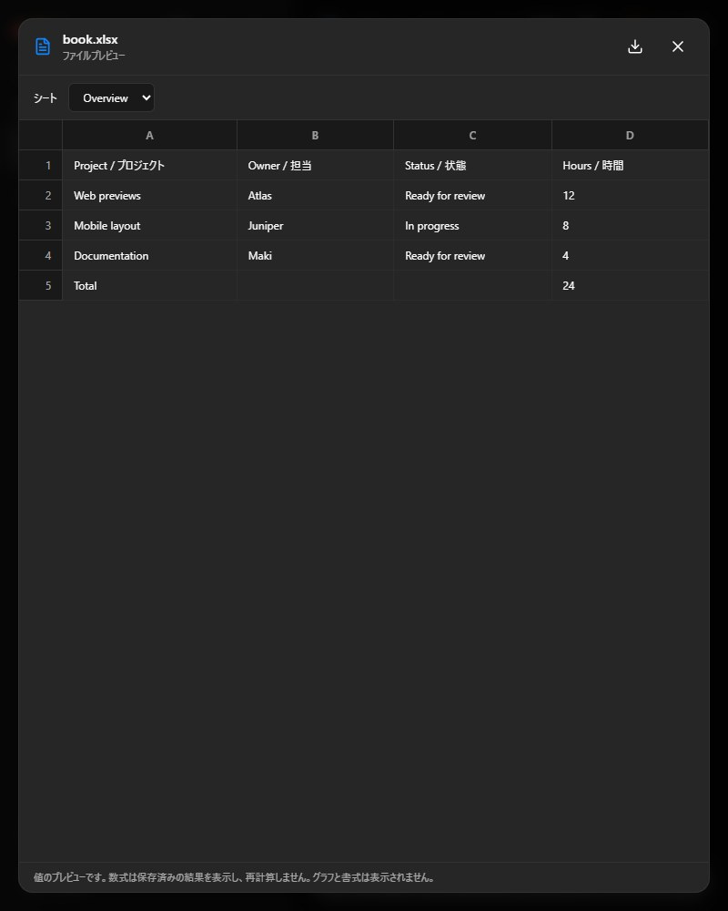
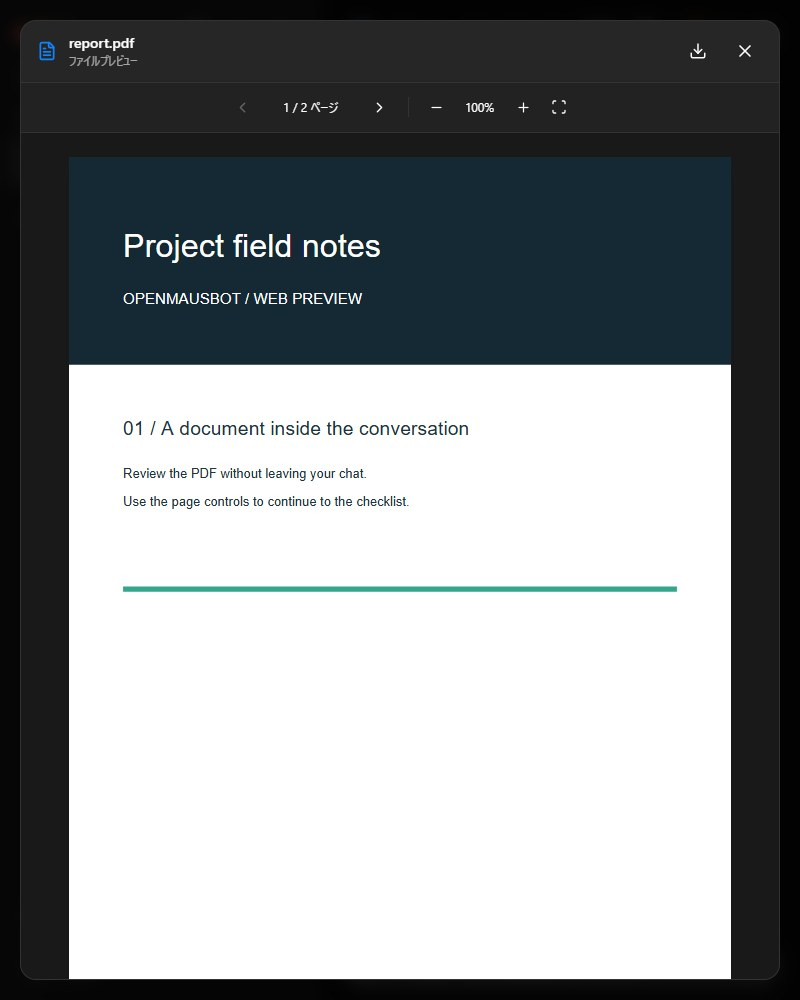

# A bot makes a file in its VM and attaches it to the chat

Captured on 2026-09-19 with a real Claude Code CLI (2.1.251) running Z.ai
`glm-5.3`, a per-bot Podman Local VM desktop, and the production build served by
the real `server/index.ts` (`OMB_STATIC_DIR`) on a disposable data directory.
Every assistant message in the session transcript records `glm-5.3`.

## What was wrong

A bot working in its own Local VM had two problems:

1. **It could not hand over its work.** The only way to put a file in the chat was
   a Markdown link, and a link to `/home/cua/workspace/...` cannot be opened by the
   server (the VM home is a bind mount outside every allowed root). Previews failed
   with "Preview unavailable".
2. **It could only run commands by typing into a terminal window and reading
   screenshots.** Cua Driver exposes no shell tool. A first real run took about 9
   minutes, then reported success although the PDF did not exist.

## What this adds

- **`attach_file`** (agents MCP). The bot passes a path: a VM path such as
  `/home/cua/workspace/report.pdf`, a path relative to its VM workspace, or a file
  in its working folder. The server opens it with the same hardened resolver the
  message-file route uses, copies it into the private attachment store, and posts it
  as the bot's own message. Images become `image` attachments, everything else a
  `file` attachment served only through the message that carries it.
- **`vm_exec`** (agents MCP). Runs one shell command in the bot's own Local VM (as
  the desktop user, in `/home/cua/workspace`) and returns the exit code, stdout and
  stderr as text. The time limit (default 60 s, at most 300 s) is enforced inside
  the container with `timeout`, so a runaway process is really stopped.
- **Audio preview.** mp3, m4a, aac, wav, ogg, opus and flac play inline.
- **A simpler attachment look.** No bubble around a message that is only files, no
  framed "Attachments N" box, no storage-id caption under an image, and images keep
  their own shape. Documents, video and audio stay as compact cards.
- Limits: 25 MB (images 10 MB), 10 attachments per turn, and refusals that name the
  supported types.

## The original request, done by the bot

Request, word for word: *"架空のネコネコカンパニーの決算書を作成して、PDFで納品してください。"*
No extra instructions, no help. The bot finished in about 85 seconds with four tool
calls, no approval card, and no screenshots:

| # | Tool | What it did | Result |
| --- | --- | --- | --- |
| 1 | `vm_exec` | check for `reportlab` and a CJK font | exit 1 (not installed), font present |
| 2 | `vm_exec` | `pip install --user reportlab` | exit 0 |
| 3 | `vm_exec` | write and run `make_kessan.py` in the VM workspace | exit 0, PDF of 6,470 bytes |
| 4 | `attach_file` | attach the PDF | "Attached … (6470 bytes). It now appears in the chat with a preview." |

The file exists on the host under the VM home, the thread holds one `application/pdf`
attachment authored by the bot, and the chat renders it. Nothing was staged: the
bot made the file.

| Cover | Balance sheet | Cash flow |
| --- | --- | --- |
|  |  |  |

Japanese text renders correctly. The figures agree across statements (total assets
298,200 = liabilities 84,700 + net assets 213,500). Cosmetic flaw in the bot's own
PDF: on page 3 the title overlaps the period line.

## Eight deliverables

The eight files were staged in the bot's VM workspace by the test, not created by
the bot: png, jpg and gif from `ffmpeg` test sources, a 3 second 440 Hz mp3, the
repo's sample mp4, and pdf, xlsx and pptx fixtures. The bot was told the file names
and asked to attach them. **The bot's part is real**: GLM-5.3 called `attach_file`
once per file, the server copied each out of the VM, and the chat rendered all
eight.

| Check | Result |
| --- | --- |
| Stored on the thread | image/png, image/jpeg, image/gif, video/mp4, audio/mpeg, pptx, xlsx, pdf |
| Audio | duration 3 s, `currentTime` advanced to 1.54 s, `paused: false`, source is an authorized blob |
| Video | duration 3 s, `currentTime` advanced to 1.6 s, `paused: false`, native controls on click |
| Browser console | no errors in any capture |

| Slide deck, 1 of 2 | Workbook, sheet selector | PDF, 1 of 2 |
| --- | --- | --- |
|  |  |  |

## Found only by running it for real

- The first run returned "No file was found" for all eight files even though the VM
  could see them: the `agents` capability carries no VM target, so the tool must
  read the thread's claimed desktop (`localVmThreadTargets`). The test-only
  capability endpoint cannot provision a VM, so no automated test could catch it.
- The first tool description told the model to check the file exists first. GLM then
  ran `ls` with the host Bash on a VM path, which is meaningless and raised approval
  cards. The description and VM prompt now say `attach_file` reports a missing file
  itself.
- Even then GLM spent minutes driving a terminal window through screenshots, because
  the VM had no way to run a command and read text. `vm_exec` removed that.

## Not covered

- Only the Local VM path was exercised end to end. `attach_file` also accepts files
  in a bot's working folder (unit and API tested); cloud box and VPS computers were
  not run. `vm_exec` is Local VM only.
- One run of the Z.ai/Claude Code path ended with `claude exited 1 ...
  unrecognized_model` mid-turn (a "continue" message resumed it). It did not recur
  in the final runs and is not caused by this change.

## Tests

`server/bot-attachment.test.ts` (path mapping, every supported type, refusals),
`server/container-exec.test.ts` (command line, exit codes, time limit, clipping),
`server/index.test.ts` (attach, serve only through the message, refusals, per-turn
cap, no VM), `server/drivers/agents-proxy.test.ts` (tool list, request bodies,
failure wording), `src/lib/file-preview.test.ts` (audio detection and MIME check)
and `src/components/AttachmentGallery.test.ts` (bot attachments become private
files, no duplicate card).
