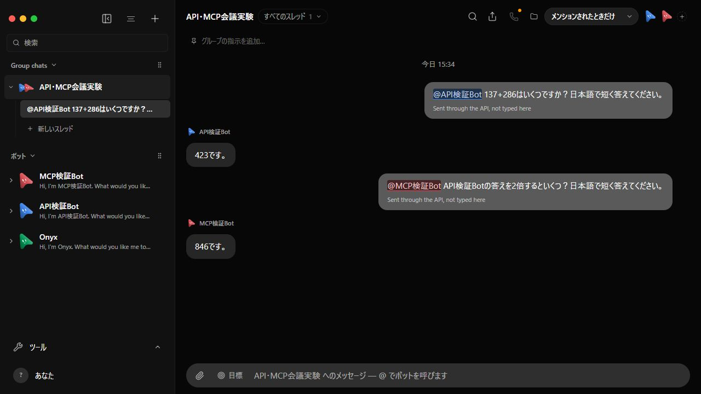

# API検証BotとMCP検証Botの両メンション

2026-09-13。上流536b7893統合版。両Botとも実Claude Code / GLM-5.3。

会議を「メンションされたときだけ」に設定し、HTTP APIで @API検証Bot に137+286を質問 → API検証Botが423と回答。実MCP stdioで @MCP検証Bot にAPI検証Botの答えの2倍を質問 → MCP検証Botが846と回答。

両回答のfrom.botIdと数値、会議のmentions設定をassert。実ブラウザのスクリーンショットで青の @API検証Bot、赤の @MCP検証Bot、それぞれの発言者と回答を目視確認した。

transport.json: HTTPおよび実MCPの要求・応答。summary.json: 検証結果。provider-models.json: 実CCセッションのモデル。ui-snapshot.txt: 表示DOM。cleanup.json: 一時データの削除結果。

実行: OMB_EVIDENCE_DIR=docs/verification/evidence/both-mentions-20260913/glm を設定してlaunch-api-mcp-glm.mjsで起動し、node scripts/verify-both-mentions.mjs http://127.0.0.1:21301 --glm を実行。ポートは起動ごとに変わる。資格情報を証拠に含めず、既存アプリの会話データは変更していない。
