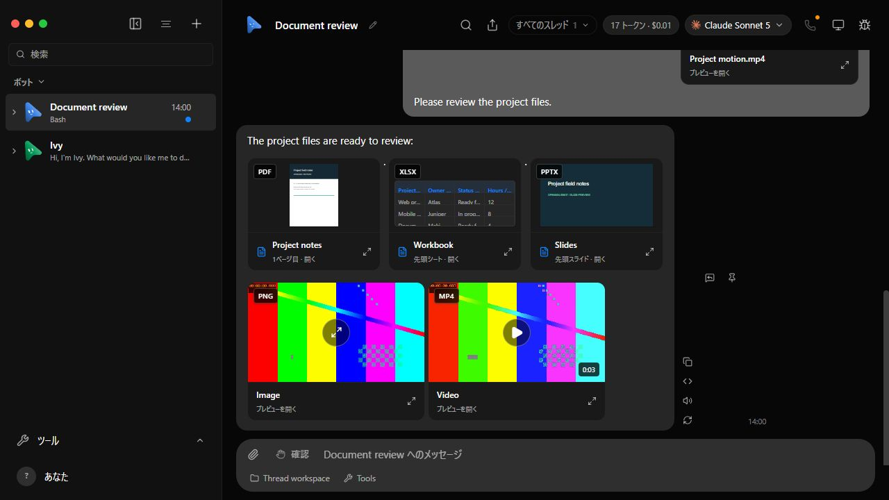

# Inline previews on current upstream main

Captured on 2026-09-12 against `milind-soni/OpenMausBot` main `2f91c462`.
The after build is `d76d50d8`, with the preview proposal merged onto that base.
The before worktree contains only copied synthetic fixture helpers, not the
production preview changes. Both fixtures use temporary homes and fake engines.
The baseline rejects video uploads and uses its default fake response.

| Before | After |
| --- | --- |
|  |  |

| PDF page 2 | Spreadsheet Checks sheet |
| --- | --- |
|  |  |

| PowerPoint slide 2 | 390px viewport |
| --- | --- |
|  |  |

## Observed behavior

- PDF, XLSX, PPTX, PNG, and MP4 badges appear at the top left, 8px inside
  thumbnail containers (9px including the image gallery border).
- Bot links render the PDF first page, spreadsheet cells, first slide, image,
  and video poster. Uploaded document cards use the same preview components.
- Both videos start paused at 0.1s, readyState 4. Clicking the bot video play
  control yields `paused: false`, `currentTime: 0.231424`, `controls: true`.
- PDF page 2, the workbook's Checks sheet, and slide 2 are accessible through
  their controls. Markup in a spreadsheet cell remains literal text.
- At a 390 by 844 viewport, document scrollWidth is 390; closing the slide
  preview returns focus to the originating file button.

## Commands and checks

```sh
pnpm install --frozen-lockfile
pnpm build
pnpm lint
pnpm i18n:check
pnpm exec vitest run src/lib/file-preview.test.ts src/lib/preview-queue.test.ts src/components/AttachmentPreview.test.ts src/components/ChatMarkdown.test.ts server/attachments.test.ts server/message-file.test.ts server/file-preview.e2e.test.ts server/control-omb.test.ts
pnpm exec vitest run src/lib/load-file-preview.test.ts
node --experimental-strip-types scripts/verify-file-preview.ts --built
```

Build (including both TypeScript checks), lint, and locale validation pass.
Focused tests: 152 passed, one failed. The failure is the existing symlink
containment test: Windows rejects symlink creation with EPERM. Running
`server/message-file.test.ts` on unmodified `2f91c462` reproduces the same failure
(15 passed, one failed). The security assertion is retained.

`pnpm broker:test` passes eight tests. `pnpm test:packaged-server` boots the
packaged harness without node_modules, checks all 12 proxy paths, and verifies
the MCP stdio handshake. `pnpm test:electron` reports 162 passed, two failed,
10 skipped: both failures require POSIX `mv` in the AppImage updater tests.
The unchanged baseline's updater file reproduces both failures (seven passed,
two failed, one skipped). No Electron implementation files are changed here.
Both browser fixture launchers reported `cleaned: true` after being stopped.

The full `pnpm test` run and current CI results are recorded in the PR; this
focused result is not a claim that the full suite passes. Machine-specific
fixture transcripts and logs stay local. See the earlier
[modal verification](../file-preview/README.md) for the original proposal's
Japanese PDF, invalid PDF, download, and video-playback evidence.

## Review fixes on 2026-09-12

Commits `47368c26` and `0cf173f5` address explicit fixture reply precedence,
committed thumbnail callbacks, metadata-ready video playback, and bounded
actual ZIP inflation. The dependency `fflate@0.8.3` was already transitive and
is now direct so the preview can use its streaming inflater explicitly.

Before these fixes: [existing capture](after.jpg). After the fixes:



The production fixture again rendered PDF, spreadsheet and slide thumbnails.
Clicking the inline video yielded `paused: false`, `currentTime: 0.236221`,
native controls enabled, and zero dialogs. The workbook's Checks sheet and
PowerPoint slide 2 still rendered. The owned fixture reported `cleaned: true`.

`pnpm build`, `pnpm lint`, and `pnpm i18n:check` pass. The following focused
command passes all 99 tests in eight files, including actual-byte overflow
rejection for both Office parsers, stored-entry mismatches, declared budgets,
normal compressed/stored ZIPs, and explicit replies overriding parent replies:

```sh
pnpm exec vitest run src/lib/file-preview.test.ts src/lib/office-preview-limits.test.ts server/file-preview.e2e.test.ts src/lib/load-file-preview.test.ts src/lib/preview-queue.test.ts src/components/AttachmentPreview.test.ts src/components/ChatMarkdown.test.ts server/control-omb.test.ts
```

The full cross-platform checks run in upstream CI; the earlier full local
suite limitations above are retained rather than represented as passing.

## Upstream integration (2026-09-13)

Merged upstream `536b7893` without rewriting the PR history. The only textual
conflict was the fixture launcher signature. Upstream `room` and `extraProviders`
remain the sixth and seventh arguments; preview `fakeReplies` moves to the eighth
argument, with both preview callers updated. Explicit replies still override
inherited fake replies. No production preview component required conflict edits.

Validation: frozen-lockfile install, production build, 99 focused tests in eight
files, lint and locale catalog checks passed. A fresh disposable production
fixture rendered PDF/XLSX/PPTX/PNG/MP4 thumbnails, PDF page 2, workbook Checks with
literal HTML text, and slide 2. Inline video played on click (paused=false,
time=0.225504, controls=true). The fixture closed with cleaned=true.

Compare the prior `review-after.jpg` with `merge-after.jpg` for the real chat
before and after upstream integration; the new upstream composer is retained.

The CodeRabbit docstring-coverage warning remains an advisory documentation
metric, not a failed executable check. Existing parser limits and cleanup are
documented in code and the verification guide. The old CLA comment does not
apply: the current proposal changes no enterprise files.


### Upstream integration and documentation review (2026-09-13)

Integrated upstream `f8cbc562` in `01b60c05`. The Box fixture endpoint remains
argument 8 and preview replies move to argument 9; both preview callers were
updated. The lifecycle test retains upstream failure evidence and graceful IPC
cleanup. English preview strings and upstream canvas strings are both retained.

Validation after integration:

- Typecheck, production build, and lint passed.
- 166 focused tests passed; the remaining local message-file symlink test failed
  with Windows EPERM during setup. Its assertion is retained for CI.
- An additional 18 archive-limit and locale-generator tests passed.
- The complete API file passed 208 tests with one existing skip (295.46 seconds).
- The real team-lifecycle fixture and original UI launcher case passed. The new
  upstream OpenRouter fixture exposed another SIGINT cleanup call on Windows;
  the shared IPC fix and a rerun are required before calling that check green.
- Updated 23 stale Ukrainian translations and their source hashes in `b585d59c`;
  locale checks pass for all 10 languages. Native-speaker human review was not
  performed locally.

`06bc9c08` adds JSDoc describing request identity, authority, buffer/URL ownership,
parser budgets, cancellation, and queue release obligations. CodeRabbit must
recompute coverage after push; the prior 31.11% warning is not yet cleared.
The final integrated head still requires fresh cross-platform CI and review.


The shared IPC repair `c96581b8` was incorporated as `90aee291`. The previously
failing OpenRouter UI case then passed alone (33.80 seconds), including clean
exit zero and fixture-data removal. The other case was excluded by the test-name
filter; it passed in the preceding run. New canvas/shared-computers fixture
verification is coordinated with the shared test-repair task.
