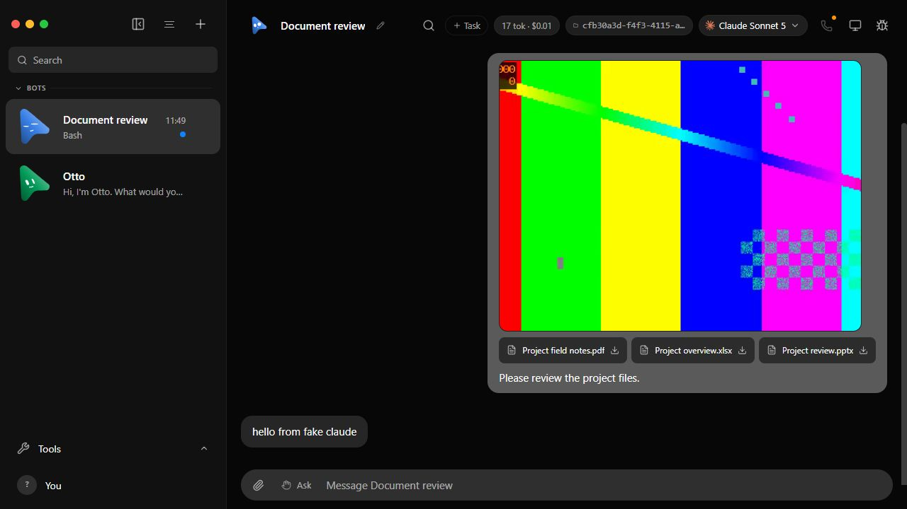
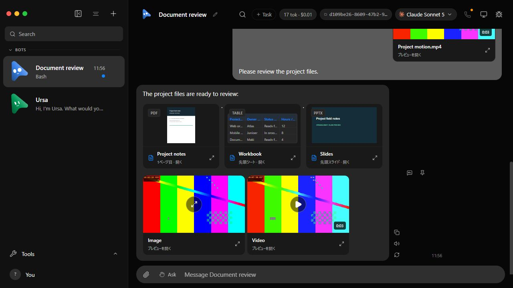
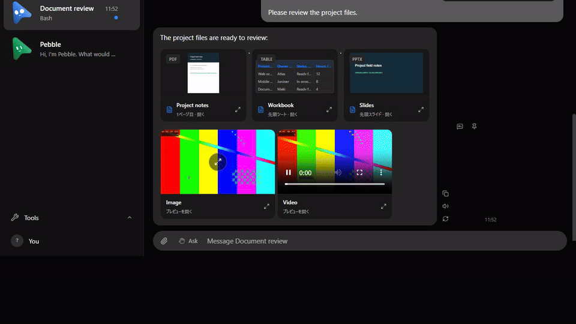
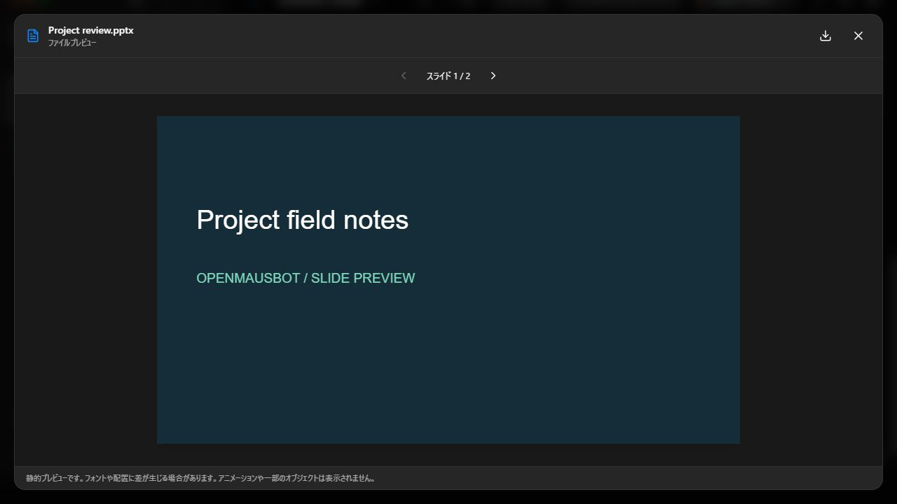
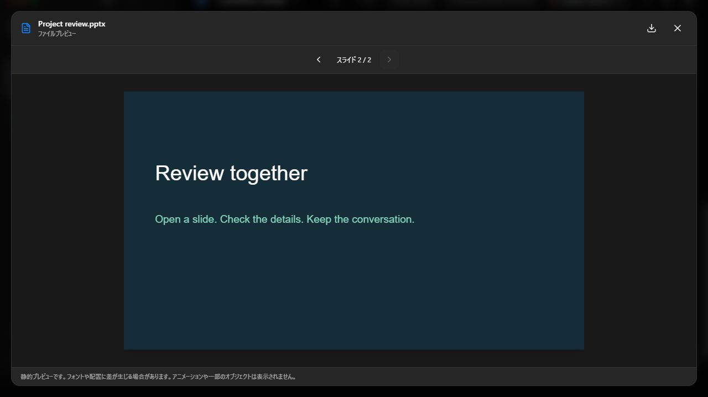
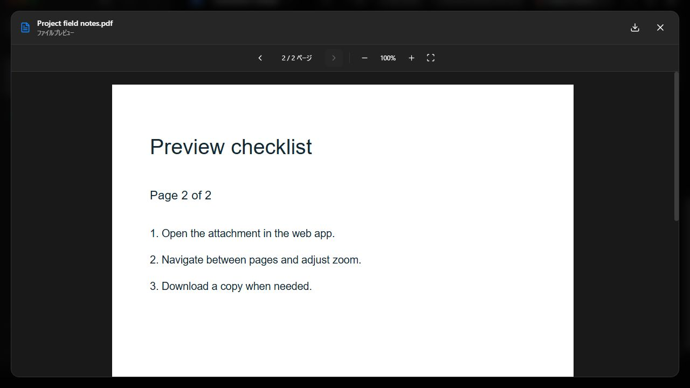
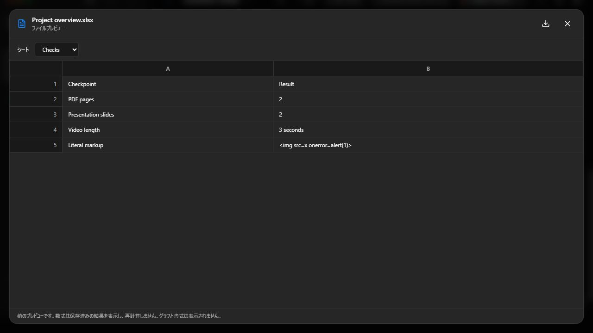
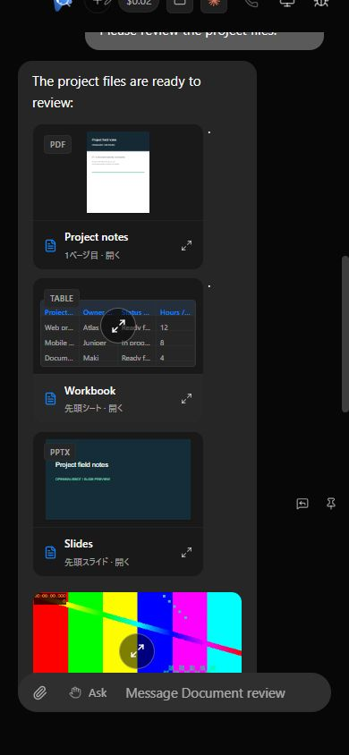
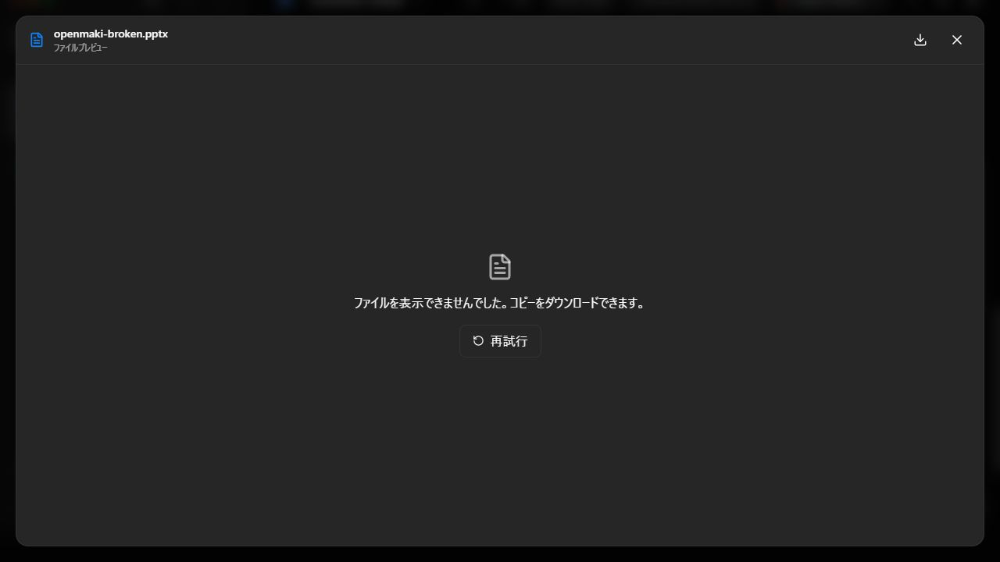

# Chat media and document preview evidence

Recorded September 12, 2026 in the Codex in-app Chromium browser on Windows.
All files and conversations are synthetic, served by an isolated fake engine.
Before: fork develop `a66cd882`. After: implementation `c0f9ff47`, production
build served by `node --experimental-strip-types scripts/verify-file-preview.ts --built`.
No live app or model credentials were used.

## Actual before and after

The baseline worktree contains unchanged application sources. Only verification
helpers were copied into it; unsupported video uploads were skipped. It shows
the original image gallery and download-only document cards. The after fixture
also returns scripted bot file links to exercise both attachment entry points.

The GIF was captured against the development server with the same production
implementation. The final built app was checked independently: inline video
had `paused=false`, `controls=true`, `currentTime=0.205255`; opening the full
preview changed the inline player to `paused=true`, `currentTime=0.304089`.
Neither the new full player nor the other attachment video autoplayed.

## Browser observations

- PDF cover, first slide SVG, first-sheet values, image, and video poster render
  without opening a modal; full viewers retain page/slide/sheet controls.
- At 390 x 844, document scroll width and viewport width both equal 390.
  Visible images finish decoding and the visible video reaches readyState 4.
- Scrolling away releases card data; returning loads it again without playback.
- A plain-text file named `.pptx` produces a fallback card. Opening and retrying
  settle to the localized error with a download link. Closing restores focus
  to that file's preview button and leaves the composer available.
- Download bytes and authorization are verified by API tests. Presence of the
  browser download link is verified; an operating-system save is not claimed.
- The fixture accepts `stop` on stdin for graceful, owned-child cleanup. Its
  development optimizer cache lives inside the isolated fixture, avoiding
  interference when before/after worktrees share installed dependencies.

## Automated checks

- `pnpm build`: passed (TypeScript and production bundles).
- Eight focused preview/attachment/authorization test files: **113 passed**.
  The command is listed in [the verification recipe](../../file-preview.md).
- `pnpm i18n:check` and targeted Oxlint: passed.
- Follow-up AVIF/BMP MIME routing check: 5 media-type cases passed; final
  `pnpm typecheck` passed. `pnpm check:electron` syntax-checked 113 modules.
- Fixture shutdown recheck: with its browser tab still open, entering `stop`
  returned exit 0 and `cleaned=true`; the built server closes active connections.
- `pnpm broker:test`: 7 passed; `pnpm test:packaged-server`: passed.
- `pnpm test:electron`: 131 passed, 1 failed, 5 skipped. The failed AppImage
  installer test invokes POSIX `mv`, unavailable here; the unchanged baseline
  reproduces the same failure.
- Full Vitest is **not green**. After: 153 failed / 3692 passed; before:
  56 failed / 3769 passed. Both runs fail in the same four test files:
  `server/index.test.ts`, `electron/browser-closed-shadow.electron.test.mjs`,
  `server/message-file.test.ts`, `server/turn-images.test.ts`.
  The server process crashes at different points, producing different cascades
  of fetch failures. The other failures are the real Electron fixture and
  Windows symlink EPERM. Counts alone do not prove absence of regressions;
  required remote CI remains a separate integration gate.
- After both full runs completed, `pnpm exec vitest run server/index.test.ts`
  passed independently: **198 passed, 1 skipped** in 192.87 seconds. This resolves
  the server-specific recheck; it does not make either earlier full run green.

Raw command logs, server paths, fixture identities, and video source frames stay
local under `.gitignore`. The sanitized comparison records counts/failure names
and log hashes so this report remains auditable without publishing local paths.

## Scope

Cards are 192px for documents and 256px for media, capped by available width.
PPTX is a static approximation; animations and some objects/fonts may differ.
Excel shows saved values, without formula recalculation or chart reproduction.
Legacy `.ppt` retains download behavior. Automatic previews are bounded to
25 MiB, two active loads/parsers, and the first page/slide/sheet sample.
All document rendering stays local; no external Office viewer receives files.

The previous foundation was adopted in `cbbf46ad` from upstream proposal
`19b0dcde`. [Upstream #959](https://github.com/milind-soni/OpenMausBot/pull/959)
was still an open draft when checked on September 12; this fork feature is
independent of its merge. Historical evidence is kept in `../file-preview`.
