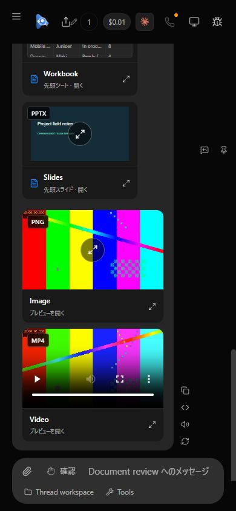

# Inline previews on current upstream main

Captured on 2026-09-12 against `milind-soni/OpenMausBot` main `2f91c462`.
The after build is `d76d50d8`, with the preview proposal merged onto that base.
The before worktree contains only copied synthetic fixture helpers, not the
production preview changes. Both fixtures use temporary homes and fake engines.
The baseline rejects video uploads and uses its default fake response.

| Before | After |
| --- | --- |
|  |  |

| PDF page 2 | Spreadsheet Checks sheet |
| --- | --- |
|  |  |

| PowerPoint slide 2 | 390px viewport |
| --- | --- |
|  |  |

## Observed behavior

- PDF, XLSX, PPTX, PNG, and MP4 badges appear at the top left, 8px inside
  thumbnail containers (9px including the image gallery border).
- Bot links render the PDF first page, spreadsheet cells, first slide, image,
  and video poster. Uploaded document cards use the same preview components.
- Both videos start paused at 0.1s, readyState 4. Clicking the bot video play
  control yields `paused: false`, `currentTime: 0.231424`, `controls: true`.
- PDF page 2, the workbook's Checks sheet, and slide 2 are accessible through
  their controls. Markup in a spreadsheet cell remains literal text.
- At a 390 by 844 viewport, document scrollWidth is 390; closing the slide
  preview returns focus to the originating file button.

## Commands and checks

```sh
pnpm install --frozen-lockfile
pnpm build
pnpm lint
pnpm i18n:check
pnpm exec vitest run src/lib/file-preview.test.ts src/lib/preview-queue.test.ts src/components/AttachmentPreview.test.ts src/components/ChatMarkdown.test.ts server/attachments.test.ts server/message-file.test.ts server/file-preview.e2e.test.ts server/control-omb.test.ts
pnpm exec vitest run src/lib/load-file-preview.test.ts
node --experimental-strip-types scripts/verify-file-preview.ts --built
```

Build (including both TypeScript checks), lint, and locale validation pass.
Focused tests: 152 passed, one failed. The failure is the existing symlink
containment test: Windows rejects symlink creation with EPERM. Running
`server/message-file.test.ts` on unmodified `2f91c462` reproduces the same failure
(15 passed, one failed). The security assertion is retained.

The full `pnpm test` run and current CI results are recorded in the PR; this
focused result is not a claim that the full suite passes. Machine-specific
fixture transcripts and logs stay local. See the earlier
[modal verification](../file-preview/README.md) for the original proposal's
Japanese PDF, invalid PDF, download, and video-playback evidence.
