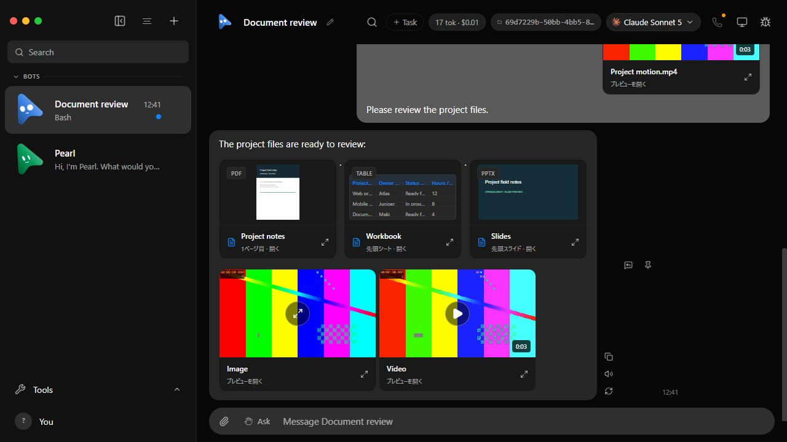
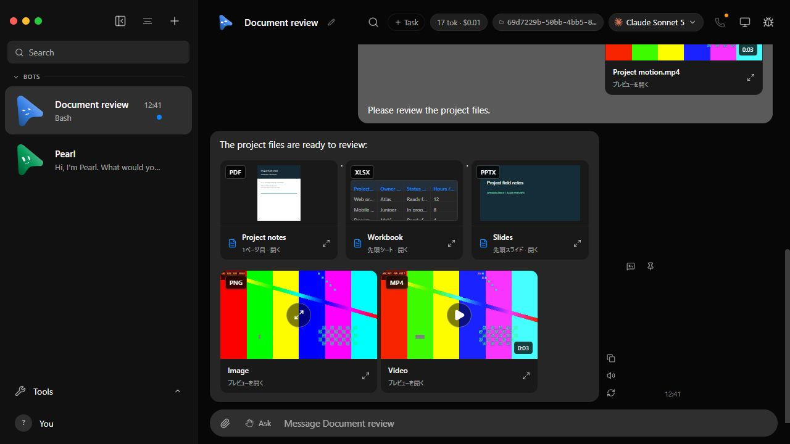
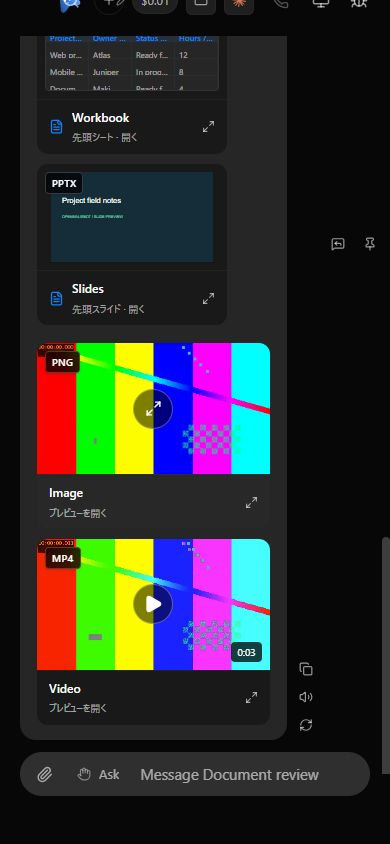

# Preview extension labels

September 12, 2026. Before: fork develop `5d084314`. After: `48f026fd`.
Actual browser captures use the isolated fake-engine `verify-file-preview.ts`
fixture and synthetic files; no live application data was used.

PDF, XLSX, PPTX, PNG, and MP4 now have matching top-left extension badges.
The nine file-card labels were all measured at x=9, y=9 relative to the card's
outer border. Uploaded-image thumbnails use the same badge. Labels remain
visible without waiting for decoding and do not receive pointer events.

Validation: `pnpm build` passed; the existing AttachmentPreview, ChatMarkdown,
and file-preview suites passed 32 tests. Targeted Oxlint reported no errors
and the unchanged control-character-regex warning in AttachmentPreview.
Inline video played (`paused=false`, `currentTime=0.231359`), the PDF dialog
opened and closed, and the 390px viewport had a 390px document scroll width.
Raw build/test logs remain local. No additional tests were introduced for this
display-only change; full platform CI remains the integration gate.

Review follow-up: image badges now carry the source filename separately from
the accessible description. Two regression cases prove that both descriptive
alt text and misleading `.pdf` alt text still show PNG for `/photo.png?download=.pdf`.
The focused suites now pass 34 tests; the sample screenshot appearance is unchanged.
