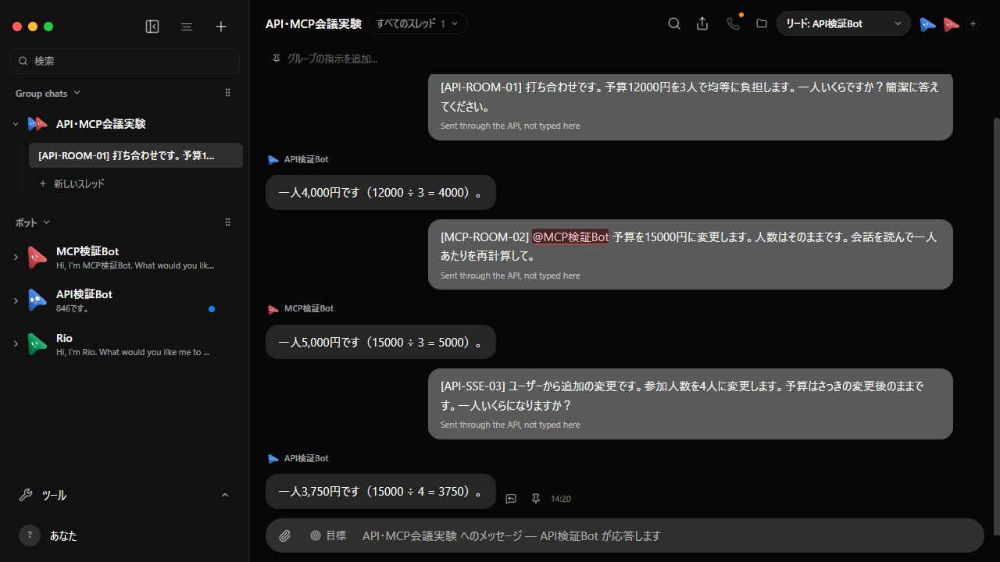

# 最新本家での CC GLM-5.3 API・MCP 実機検証

2026-09-13 / Windows。上流 `536b7893`（0.1.76）を OpenMakiBot の同期ブランチへ統合した `c2aae12f` で実行。

## 結果

- ユーザー側 HTTP API → OpenMakiBot → Claude Code 2.1.251 → GLM-5.3 が実応答。
- MCP は実際の stdio JSON-RPC（initialize / tools/list / tools/call）を使用。
- DM: 137+286 → 423、MCPで「前の答えを2倍」→ 846。
- 会議: APIで12000円/3人 → 4000円、MCPで @MCP検証Bot に予算15000円へ変更 → 5000円、APIで4人へ変更 → 3750円。
- 最後の回答はSSEでも受信。画面で @MCP検証Bot の赤いハイライトと5,000円・3,750円の回答を確認。
- provider-models.json は実Claude Codeセッションに記録された assistant の model=glm-5.3 を抽出。
- [API-ROOM-01] 等は検証用に付けた識別子で、製品仕様や必須の書式ではない。



## 証拠と実行

- summary.json: 各API/MCP操作と回答の検証結果。
- transport.json: 実MCP stdioの要求・応答。
- sse.json: 実際のストリーミング受信。
- fixture.json / provider-models.json: 使用ランタイムとモデル。
- cleanup.json: 所有する一時環境の停止・削除（dataExists=false）。

```powershell
node scripts/launch-api-mcp-glm.mjs C:/Users/makim/.local/bin/claude.exe
node scripts/verify-api-mcp.mjs http://127.0.0.1:22261 --glm
node scripts/verify-api-sse.mjs --glm
$env:OMB_PORT='22261'; pnpm exec vite --host 127.0.0.1 --port 15220 --strictPort
```

ランチャーはこのPCの既存CC設定を読み取り、資格情報だけを一時環境へ渡す。既存アプリの会話やデータには書き込んでいない。資格情報は証拠に保存していない。ランチャーの初期ヘルスチェック用fakeサーバーは会話前に停止し、全会話は実CCプロセスで実行した。

## 統合検証

- pnpm build / pnpm lint / pnpm i18n:check: 成功。
- MCP、control-omb、添付、プレビュー、Markdown、mentions の関連テスト: 6ファイル145件成功。
- fork policy とその7テスト: 成功。
- 全プラットフォームCIはPR #2で別途確認する。上記の実機検証のみで全CI成功とはしない。
