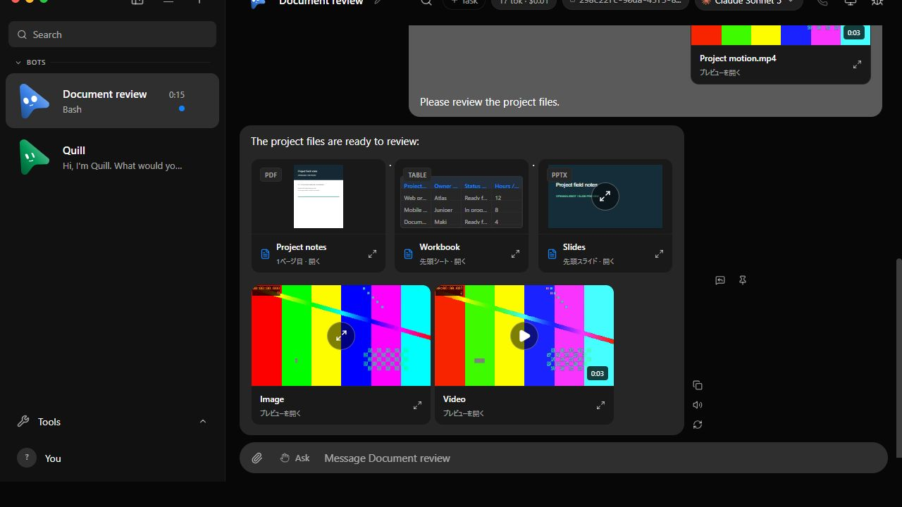
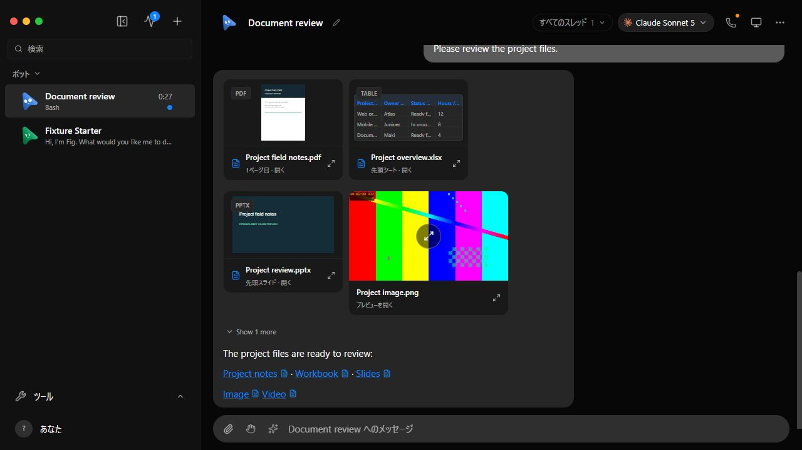
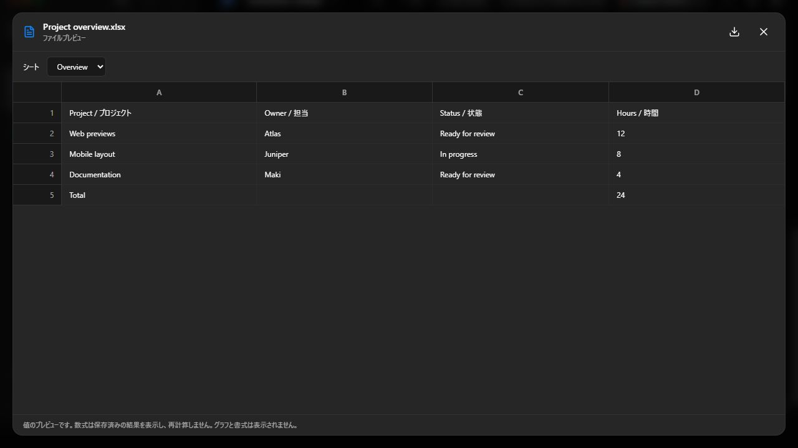
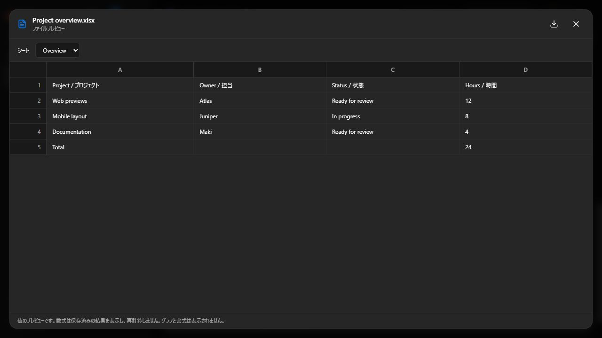

# OpenMakiBot upstream synchronization — 2026-10-03

The comparison uses the existing preview feature at `3461c9f2` and the
integration of upstream `033fd71f` (OpenMausBot 0.1.93). Each side uses a
disposable verification home, fake agent replies and generated sample files.
These checks do not exercise live providers or the user's application data.

## Reproduce

```sh
pnpm exec vite build
node --experimental-strip-types scripts/verify-file-preview.ts --built
```

Use the printed `previewUrl`. Open the Document review conversation, dismiss
the fixture's welcome tour, and open the sample files. Close the browser tab
and enter `stop` in the foreground launcher to finish the fixture.

## Checked behavior

- PDF opens from its gallery thumbnail and its inline caption; page 2 of 2
  contains the checklist.
- XLSX displays both Overview and Checks; the saved Total is 24, and the
  literal HTML sample remains text.
- PPTX opens and navigates to slide 2 of 2.
- The sample PNG decodes to 640 × 360 pixels. The MP4 decodes as three seconds,
  and native playback advances its current time.
- The gallery loads video only on request. Inline captions open the same
  file preview without adding a second thumbnail or preloading another copy.
- Document thumbnails wrap within the gallery. The video footer is a save
  action rather than a second video card. Modal close restores caption focus.
- At a 390-pixel viewport there is no horizontal overflow, and keyboard focus
  shows the central expansion hint. This is a responsive and keyboard check;
  the browser capability does not emulate touch/pointer media. The touch hint
  class policy is covered by the permanent touch-actions tests.

## Evidence

| Surface | Before | After |
| --- | --- | --- |
| Chat and file thumbnails |  |  |
| Workbook preview |  |  |

The focused verification passed 137 tests across ChatMarkdown,
AttachmentPreview, AttachmentGallery and the preview libraries. The final
gallery layout also passed its 20 tests. TypeScript, scoped lint and the
production Vite build passed after the integration fixes. Vite retained its
existing CSS pseudo-element and large-chunk warnings.

Two early baseline launcher attempts ended before their normal cleanup.
Their exact server PIDs were verified stopped; their temporary fixture
directories remain because automatic approval review rejected the recursive
cleanup with `blocked by policy`. Exact local paths and PIDs are recorded in
the local `.omb-scratch/sync-20261003/report.json` and are not published here.
The final after fixture exited through foreground `stop`, printed
`{"cleaned":true}`, and its temporary data directory was verified removed.
