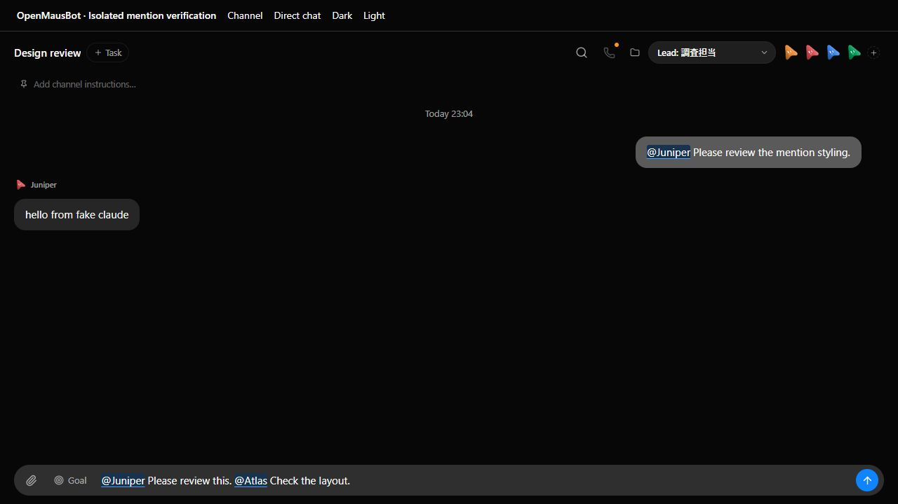
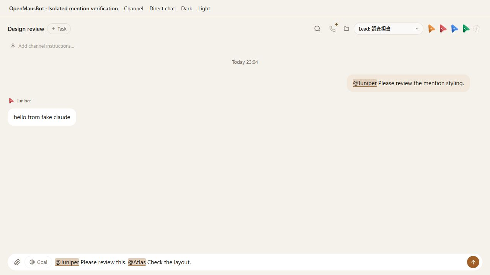

# Mention highlighting

Launch a disposable fake-engine server and the real channel/direct chat views:

```sh
node --experimental-strip-types scripts/verify-mentions.ts
```

Open the printed `previewUrl`. The fixture creates Atlas, Juniper, a Japanese-named
bot, and a Design review channel. It uses the real StoreProvider, Composer,
ChatView and GroupView. No live account, provider, or user data is used. Ctrl-C
stops the fixture servers and removes their temporary data directory.

## QA inventory

| Path | Check | Evidence |
| --- | --- | --- |
| Channel composer | Type `@Jun`, choose Juniper with Tab, append ordinary text, send with Enter | The selected name stays highlighted; the channel settles with Juniper's fake-engine reply |
| Candidate keyboard controls | Type `@`, move with ArrowDown, select the Japanese name with Enter; Escape dismisses the picker | The native textarea keeps the selected name and caret |
| Multiple mentions | Enter `@Juniper Please review this. @Atlas Check the layout.` | Both complete names highlighted in the draft |
| Japanese and everyone | Enter `@調査担当 確認して`, Shift+Enter, then `@everyone 確認して` | Both names highlighted in a channel; newline retained |
| Negative matches | Enter `me@Juniper.test @Ghost @Juniper2 @調査担当 確認して` | Only the Japanese bot is highlighted |
| Long draft | Paste 12 lines, choose Display in chat box, scroll inside the textarea and edit at the end | Mirror and textarea widths, wrapped heights and scroll offsets agree; 12 mentions retained |
| Direct chat | Switch to Direct chat; select Juniper by mouse and send | User bubble highlights the mention and the task settles |
| Direct chat scope | Enter `@everyone @Atlas @Juniper` in Atlas's direct chat | Only Juniper is highlighted |
| Responsive draft | Resize from desktop to 390px with the multiple-mention draft | Input grows to three lines; mirror and textarea both measure 80px |
| Skins | Switch Dark → Light → Dark | Names remain legible in the composer and sent bubbles |
| Markdown | Run ChatMarkdown tests | Prose/lists/tables highlight known names; code, links and HTML safety are preserved |

## Recorded run

Verified on Windows in Chromium on 2026-09-07 against upstream `9c681f44`
(0.1.61) and the mention-highlight change. Both channel and direct-chat `wait`
results were `settled`; bounded transcripts are in `evidence/mentions/`.
Long-draft checks measured matching 584px scroll heights and 440px scroll
offsets for the textarea and mirror. Editing while scrolled retained alignment.
The 390px check covers the composer; the existing channel header still overflows
at that width. A development-only createRoot warning occurred during fixture
hot replacement; the final screenshots were taken after a full reload.

Final local checks: typecheck, renderer build, lint (existing warnings), the skin
contrast check, 27 focused tests, 8 broker tests and packaged-server smoke passed.
The full Vitest run completed with 3,827 passed, 2 failed, 107 skipped and 1 todo.
Both failures were Windows `symlinkSync` EPERM in `server/message-file.test.ts`
and `server/turn-images.test.ts`; the same tests failed on unmodified `9c681f44`.
The separate Electron suite had 138 passed, 2 failed and 6 skipped. Both AppImage
installer failures require the missing POSIX `mv` command and also reproduced
on unmodified `9c681f44`. These checks therefore do not claim a fully green
Windows suite. The final fresh browser session emitted no console errors.

The fixture verifies browser renderer behavior and fake-engine message handling.
It does not establish packaged Electron, Safari, operating-system IME candidate
windows, or real-provider delegation behavior. Mention decoration uses the current
roster; historical names no longer in that roster stay plain text.

| Skin | Before | After |
| --- | --- | --- |
| Midnight |  |  |
| Atelier |  |  |
